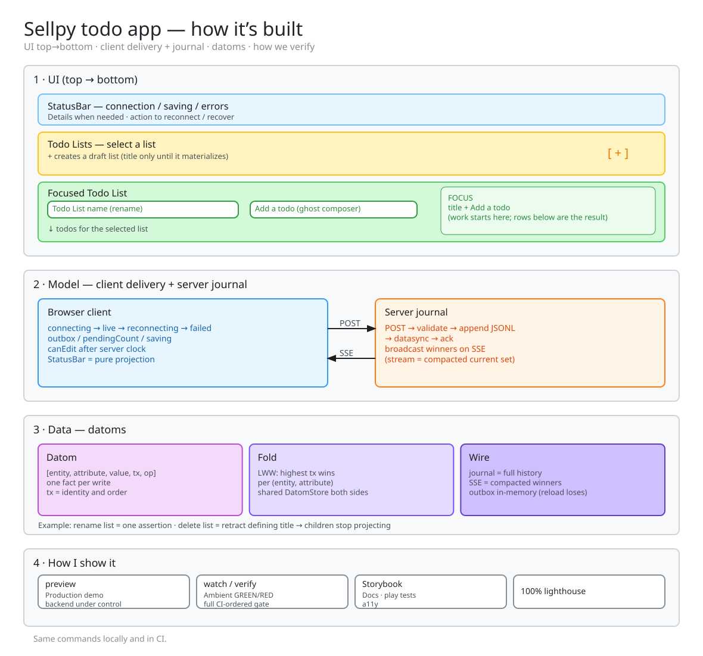

# NoNoThing SomeThings ToDo

DoNoThing SomeThing ToDo (Wip title) repo with the web interview based main task and all four additional tasks completed.

Todo lists and todos persist on the server, autosave without a save button, and converge across
browser tabs in real time. Every edit becomes one immutable [datom](https://docs.datomic.com/whatis/data-model.html#datoms) in an append-only log, which is
journalled to disk and streamed to every connected client.

## The assignment

Improve the todo list application. As given, it can only create and remove todos, and nothing is
persisted, so all state is cleared on refresh. The brief asks for the main task plus **at least
two** of the four additional tasks.

**Main task.** Persist the todo lists on the server. A database is not required.

**Additional tasks.**

- Don't require users to press save when an item is added or edited. (Autosave)
- Make it possible to indicate that a todo is completed.
- Indicate that a todo list is completed if all todo items within are completed.
- Add a date for completion to todo items. Indicate how much time is remaining or overdue.

## What was built

All five. The implementation also deliberately goes beyond the brief to make consistency,
failure handling, durability, and product trade-offs concrete enough to discuss and challenge:

- Shared browser/server datom store folding an append-only log by last-write-wins
- Crash-safe, append-only JSONL persistence across server restarts
- Real-time convergence across clients and browser tabs over Server-Sent Events
- In-memory outbox that drains on reconnect within a session (edits do not survive a reload when not connected to the server)
- Shared Zod runtime contract and deterministic read-model projection
- Completion-aware due-date status

A brief-sized implementation could stop at an in-memory server store, ordinary API writes, and
settle-based autosave. The datom journal, live convergence, session outbox, Todo List lifecycle,
and urgency-based ordering are deliberate explorations rather than requirements implied by the
assignment.



The same diagram is editable as an Excalidraw scene: `npm run whiteboard` opens Excalidraw.

## Running it

### Install

Three installs from the repo root, plus a browser. This is exactly what CI runs:

```bash
npm ci
npm ci --prefix backend
npm ci --prefix frontend
npx playwright install chromium
```

Backend and frontend keep their own lockfiles, so the root install does not reach them: `react`,
`@mui/material` and `express` live only in those trees. The last line installs the browser the
Storybook and Playwright stages run in, and is only needed on a clean machine.

`shared/` needs no install of its own. Backend and frontend pull it in through `file:`
dependencies and the root depends on it the same way, so its dependencies land in the root tree.
The root `postinstall` then generates the shared package declarations that editors and `typecheck`
read. Regenerate them explicitly with `npm run build:types`.

### Start

Run `npm start` in `backend/`, then in `frontend/`. A browser tab opens automatically on the
frontend.

| From the repo root | What it does |
| --- | --- |
| `npm run storybook` | Components in isolation, with HMR |
| `npm run preview` | Interactive demo: drives the app, and can stop the backend mid-session to show reconnect and outbox drain. click the client links a few times to get multiple sessions. |
| `npm run kill` | Frees every port this repo binds |

## Verifying

Two commands. Leave the first open while you work; run the second before you commit.

| Command | Cost | What it does |
| --- | --- | --- |
| `npm run watch` | ~2s per change | All Node + happy-dom tests and typecheck, as one GREEN/RED line |
| `npm run verify` | ~70s | Everything CI runs, in the order CI runs it |

`verify` runs four stages and stops at the first that fails, because a failure makes the stages
after it meaningless:

| Stage | Runs | Nothing runs until | Time |
| --- | --- | --- | --- |
| `static` | typecheck, lint, diagrams, audit | - (nothing executes) | ~4s |
| `unit` | shared, backend, frontend logic, scripts | Node | ~2s |
| `browser` | Storybook play + a11y, Playwright | real Chromium | ~24s |
| `quality` | build, Lighthouse, coverage | a production bundle | ~40s |

Run any part by name, and ask it what it covers:

| Command | Runs |
| --- | --- |
| `npm run verify browser` | One stage |
| `npm run verify lint e2e` | Any mix of stages and steps |
| `npm run verify help` | Prints what every stage and step covers |

CI is a single step running this same file in the same order, so a green local run cannot be
surprised by a red build.

**Coverage** is merged from the `unit` and `browser` stages and judged in `quality`. The headline
prints on the `coverage` row; `open coverage/index.html` for per-file, per-line detail. Only
non-UI logic is gated; components are judged by story states, play functions and a11y.

**Lighthouse** builds the frontend with source maps, starts isolated seeded backend and
production-preview servers, and runs three desktop audits. Performance, Accessibility, Best
Practices, SEO and Agentic Browsing must all stay at 100, and initial JavaScript transfer and
estimated unused JavaScript are held to explicit budgets. Agentic Browsing covers how readable the
site is to AI agents, which means `frontend/public/llms.txt` must stay valid Markdown with an H1
and links. Reports land in `lighthouse-reports/`; CI publishes the summary on the workflow run and
keeps the reports as an artifact for 14 days.

`npm run lint` autofixes before it judges, so it will modify files.

## Why it is built this way

| Document | What it covers |
| --- | --- |
| [`DECISIONS.md`](./DECISIONS.md) | Why the implementation makes its key choices, and what was knowingly deferred |
| [`CONTEXT.md`](./CONTEXT.md) | Domain glossary: what Todo List, Todo and Next Due Date mean here |

Architecture decision records:

- [ADR 001: Superseded error handling across domain, HTTP, and frontend boundaries](./docs/adr/001-error-handling.md)
- [ADR 004: Single-datom log with last-write-wins projection](./docs/adr/004-single-datom-log.md)
- [ADR 005: Testing seams and Storybook](./docs/adr/005-testing-and-storybook.md)
- [ADR 006: How tests are run](./docs/adr/006-test-execution-model.md)
- [ADR 007: How the UI talks to the model](./docs/adr/007-ui-to-model-convention.md)
- [ADR 008: Structured failures for datom delivery](./docs/adr/008-structured-datom-delivery-failures.md)

[ADR 002](./docs/adr/002-xstate-actors.md) and [ADR 003](./docs/adr/003-shared-datom-actor.md)
are superseded and kept only as the record of how the model arrived at one datom log. XState is no
longer a dependency. ADR 002 also carried the convention for how components reached the model;
[ADR 007](./docs/adr/007-ui-to-model-convention.md) is its successor, which ADR 004 did not write
at the time.

## Development set-up

This repo runs **Node 22**, pinned in `.nvmrc` and `mise.toml`. `verify` and `watch` refuse to run
on any other major rather than reporting results from a version the repo does not claim to
support.

ESLint is configured for every directory that is typechecked. In VS Code the standard
[ESLint plugin](https://marketplace.visualstudio.com/items?itemName=dbaeumer.vscode-eslint) picks
it up; `.vscode/settings.json` already sets the working directories. There is a `.prettierrc` so
Prettier users make no unnecessary changes.

You can open the repo root as one workspace, or `/frontend` and `/backend` separately. Both work.

Working notes for coding agents live in [`AGENTS.md`](./AGENTS.md); `CLAUDE.md` is a one-line
import of it, so both names give the same content.
