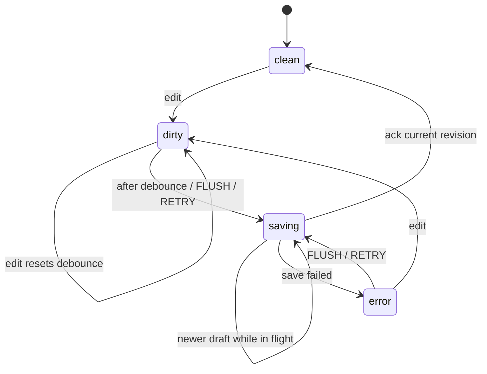

# ADR 002: XState actors for todos and autosave

## Status

Accepted

## Context

Autosave, list switching, overlapping PUTs, retries, and the “type to create” composer
are stateful protocols with many edge cases. A reducer + imperative save queue worked,
but the control flow was harder to present and easy to get subtly wrong when extending UX.

We also wanted a modern create path: no Add button — type in an empty top row; the first
non-whitespace character materializes a todo; clearing an empty row dematerializes it.

## Decision

Model the frontend with **XState v5 actors**:

| Actor | Role |
|-------|------|
| `todoListsMachine` | Load catalog, spawn per-list children, select active list, flush-on-switch |
| `todoListMachine` | Per-list draft, composer, persistence states `clean → dirty → saving → clean \| error` |

React stays a thin boundary (`useTodoLists` + presentational components). Components emit
**intent events** (`COMPOSER_CHANGE`, `TODO_PATCH`, `TODO_REMOVE`, …). Domain helpers stay
in `todoModel.js`. HTTP stays in `api/todoLists.js`.

### Persistence statechart

Delayed transition on `dirty` replaces the old `createSaveQueue` debounce. Invoked
`fromPromise` save replaces in-flight serialization; completing with a newer
`draftRevision` re-enters `saving` immediately (coalesce).

### Ghost composer

```mermaid
stateDiagram-v2
  [*] --> localEmpty: composer.text whitespace or empty
  localEmpty --> linkedDraft: first non-whitespace char
  linkedDraft --> linkedDraft: further typing patches same todo
  linkedDraft --> localEmpty: cleared and dematerializable
  linkedDraft --> released: COMPOSER_COMMIT on blur or list switch
  released --> localEmpty: composer reset; todo stays in draft list
```

Rules:

- Ghost text is local until the first non-whitespace character.
- That character prepends a real draft todo and **links** the composer to its id so
  continuous typing does not create one todo per keystroke.
- The linked todo is hidden from the numbered list until `COMPOSER_COMMIT`.
- Clearing the **linked composer** dematerializes unless `completed` or `dueDate` is set.
- Existing numbered rows keep empty text on clear (so clear-then-type edits work); use
  delete to remove them.
- Linked drafts are still included in PUT payloads (they are real draft state).

### Inspector (demo)

In development, `@statelyai/inspect` is attached via `getInspect()` so the Stately
Inspector UI can show live transitions while using the app.

Disable with `REACT_APP_XSTATE_INSPECT=0`. Never enabled in `test` or production builds.

## Consequences

**Positive**

- Edge cases are named states/events — strong interview narrative.
- Form is intent-only; save chrome is a selector over the snapshot.
- Same failure-path guarantees as the previous queue (flush on switch, coalesce, retry).

**Trade-offs**

- XState dependency and a slightly steeper onboarding curve.
- Child-actor UI updates require explicit subscriptions in the React hook.

## Alternatives considered

- Keep reducer + `createSaveQueue` — less demoable for protocol edge cases.
- React Query / SWR — poor fit for debounced whole-list PUT with local revisions.
