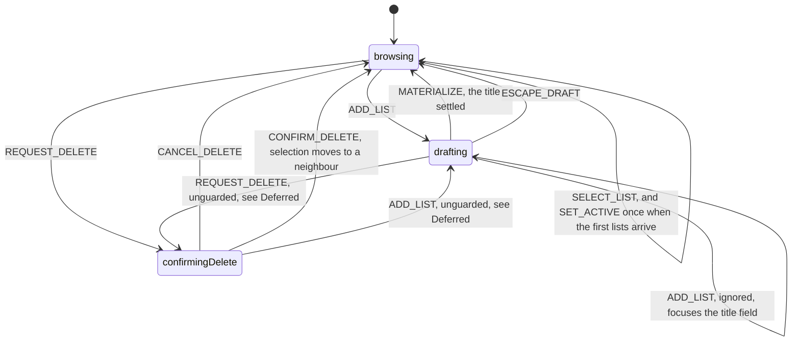
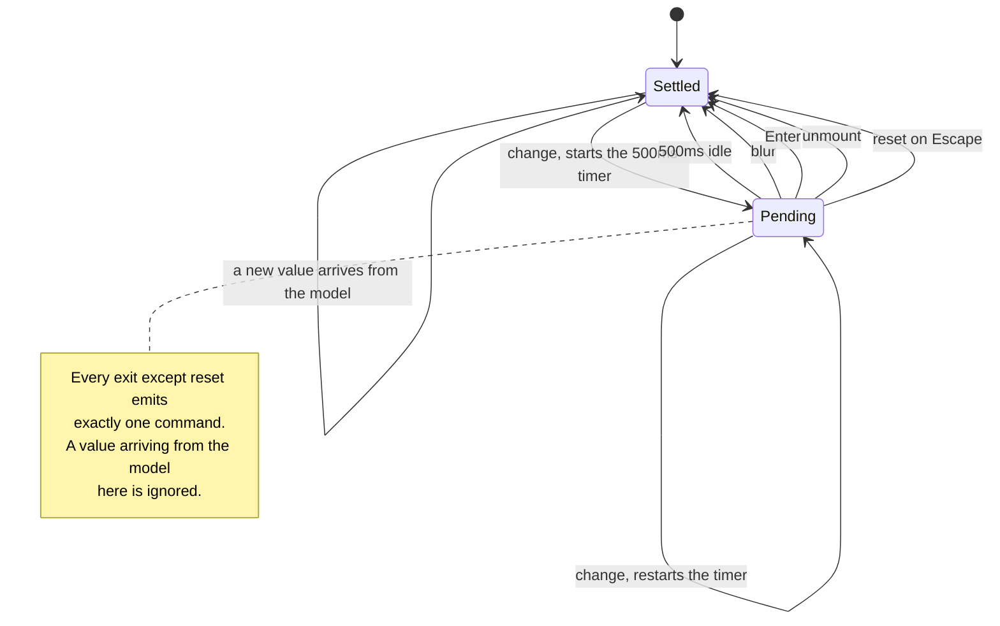
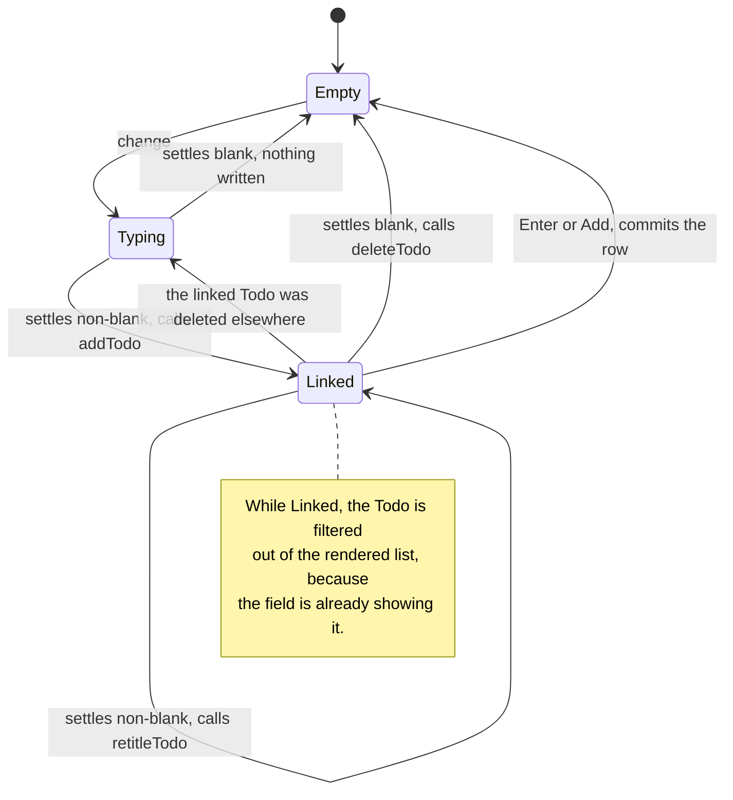

# ADR 007: How the UI talks to the model

- Status: Accepted
- Date: 2026-08-05
- Scope: Every frontend module between a rendered control and `todoClient`
- Supplies: the successor convention [ADR 004](./004-single-datom-log.md) did not write when it
  retired the actor

## Context

[ADR 002](./002-xstate-actors.md) modelled the frontend as an XState actor hierarchy and stated
the convention plainly: *"React stays a thin boundary&hellip; `TodoListForm` still emits intent
events through a single `send` prop."* [ADR 003](./003-shared-datom-actor.md) kept the actor and
moved it into `shared/`. [ADR 004](./004-single-datom-log.md) deleted it: `shared/src/todoListActor.js`
(463 lines) and `backend/src/todos/createServerTodoActor.js` are both on the removal list in
`docs/plans/single-datom-log.md`, and the README records that XState is no longer a dependency.

Deleting the actor was right. ADR 004's premise is that every user action changes exactly one
attribute of exactly one entity, and its rule 2 is *"Last write wins. There are no conflicts, no
rejections, and no rebase."* A write with no conflict path, no rollback and no pending state has
nothing for a state machine to run over, so the actor had become ceremony around a function call.

What did not happen is the part this ADR exists to fix. ADR 004 is exhaustive about the model:
the datom, entity ids, attributes, eight numbered rules, the wire protocol, the journal. It says
one thing about how a component reaches that model, under *Edit granularity*: *"In-flight text
stays in React state."* `DECISIONS.md` likewise documents persistence, API, ids, lifecycle, edit
granularity, the ghost composer and StatusBar, and nothing about UI to model. The old convention
was removed and no replacement was recorded.

The result is visible in one file. `TodoLists.jsx` uses three different conventions at once:

| Convention | Example | Where it came from |
| --- | --- | --- |
| Events to a reducer | `dispatch({type: 'SELECT_LIST', listId})` | ADR 002, survived for navigation |
| Events to a switch | `send({type: TODO_UI_EVENT.COMPOSER_CHANGE, text})` | the actor's `send` prop, outliving its actor |
| No convention | `client.assert(activeList.id, ATTRIBUTE.TITLE, title)` inline in a JSX prop | whatever was quickest afterwards |

`sendToList` is a switch statement standing where a machine used to be, holding no state and
having no transitions. The composer additionally re-implements text settling from scratch, keyed
by list id, with its own `Map` of timers and two ref mirrors, duplicating `useSettledText`, which
`TodoItem` and `TodoListTitleField` already use.

None of these three is wrong on its own. Having three is what makes the file hard to read.

## Decision

### Three owners of state, and only three

| Owner | Holds | Lives in | Survives a reload |
| --- | --- | --- | --- |
| Domain facts | what is true: titles, texts, completion, due dates, existence | the datom log | yes |
| Screen state | what the UI is offering: active list, drafting, confirming a delete | `todoListsUiState.js` | no |
| In-flight text | characters typed into a field that has not settled | `useSettledText.js` | no |

Rendering owns nothing. A component reads a projection and calls back.

### The rule

**After an interaction, ask what changed and who owns it.**

1. It changed a **domain fact**, so the datom log owns it. The component calls a **command**.
2. It changed **what the screen is offering**, so a reducer owns it. The component sends an
   **event**.
3. It changed **nothing yet**, because the text has not settled. The component neither commands
   nor sends; `useSettledText` holds it and issues one command when it settles.

The rule sorts *changes*, not clicks. One interaction may do two of these, and three do.

An earlier phrasing of this rule was "events where there are states, commands where there are
none". It is recorded here only to be rejected: everything has state, including the composer, so
that phrasing decides nothing. Ownership is the distinction that holds.

### Every interaction, classified

| Interaction | What changed | Reaches the model as |
| --- | --- | --- |
| Click a Todo List row | which list is on screen | event `SELECT_LIST` |
| Click Add | the screen offers a draft | event `ADD_LIST` |
| Escape a draft | the screen stops offering it | event `ESCAPE_DRAFT` |
| Delete a list holding Todos | the screen offers a confirmation | event `REQUEST_DELETE` |
| Cancel the dialog | the screen stops offering it | event `CANCEL_DELETE` |
| Name a draft list | a Todo List exists, **and** drafting ends | `renameList()` **and** event `MATERIALIZE` |
| Confirm the dialog | the list stops existing, **and** selection moves | `deleteList()` **and** event `CONFIRM_DELETE` |
| Delete an empty list | as above, without the confirmation | `deleteList()` **and** event `CONFIRM_DELETE` |
| Rename an existing list | a fact, once the field settles | in-flight, then `renameList()` |
| Type in a Todo's text | a fact, once the field settles | in-flight, then `retitleTodo()` |
| Composer settles non-blank, unlinked | a Todo starts existing | in-flight, then `addTodo()` |
| Composer settles non-blank, linked | that Todo's text | in-flight, then `retitleTodo()` |
| Composer settles blank, linked | that Todo stops existing | in-flight, then `deleteTodo()` |
| Toggle a checkbox | a fact, immediately | `setTodoCompleted()` |
| Pick or clear a due date | a fact, immediately | `setTodoDueDate()` |
| Delete a Todo | that Todo stops existing | `deleteTodo()` |

Sixteen interactions, no leftover category. A new interaction that does not classify is a signal
that this ADR's premise has moved, not a licence to invent a fourth convention.

### Commands are the only module that knows datoms exist

`ATTRIBUTE`, `client.assert` and `client.retract` appear in exactly one module,
`frontend/src/todos/todoListCommands.js`. Every export is named after something a person did:

```text
reserveListId()                   renameList(listId, title)
deleteList(todoList)              addTodo(listId, text) -> id
retitleTodo(todo, text)           setTodoCompleted(todo, completed)
setTodoDueDate(todo, dueDate)     deleteTodo(todo)
```

Commands return nothing meaningful except `addTodo`, which returns the minted id because the ghost
composer must link to it. The read model updates because the client applied the datom, not because
the caller was told anything.

`TODO_UI_EVENT`, `todoUiProtocol.js` and `sendToList` are therefore deleted. All five of those
events resolved to a datom write with no state transition, which made them commands wearing an
event costume. `todoListsUiState.js` keeps its events, because it has actual states.

`TodoItem` keeps its `onChange(patch)` prop. That is a leaf component reporting what changed about
its own Todo to its parent, not a component reaching the model, so the rule does not apply to it.
`TodoListForm` turns the patch into commands.

### There is exactly one timer in the frontend

`useSettledText` owns it. ADR 004 requires this under *Edit granularity*: *"Without this, typing a
twenty-character Todo would mint twenty datoms on `text`, nineteen of them superseded within a
second, and there is no transaction envelope left to group them."* Debouncing was one of the jobs
the actor did; when the actor went, the job did not, and it was re-implemented rather than reused.

**A `setTimeout` anywhere outside this layer is a defect in the architecture, not just in the
file.** There is now none: `settleTimers` in `TodoLists.jsx` was the last one, and it went when the
ghost composer moved into `TodoListForm` as `useGhostComposer`, which delegates its timing rather
than owning it.

### The complete inventory of state machines

Three, and if this convention holds no fourth can appear, because facts have no states and
rendering has no memory.

Diagrams are Mermaid, which GitHub renders inline. ADR 002 argued that live diagrams belonged in
the Stately Inspector rather than in the document; that argument went with XState. These machines
now exist only as plain reducers and hooks, so the document is the only place a reader can see
them whole, and a diagram that has to be checked against the code is worth more than one that has
to be deciphered first.

**Navigation**, in `todoListsUiState.js`. Every edge below is a `case` in that reducer, so the
diagram can be read against it line by line.



The last two edges are accepted by the reducer and reachable by no UI. They are drawn rather than
omitted so the diagram matches the code rather than the intent.

**Settling**, in `useSettledText.js`:



That last point is the only race the frontend resolves: *"An edit in flight outranks an incoming
one; last write wins either way."* It resolves in favour of the person typing.

**The ghost composer**, to live in `useGhostComposer.js`. Not a fourth machine: the settling
machine plus a rule about what each settle means.



While `Linked`, the Todo is filtered out of the rendered list because the field is already showing
it. Three states are the minimum needed to express that a Todo's defining attribute is `text`, so
a Todo with no text is unrepresentable rather than merely invalid.

Note what is absent: no machine for saving, conflicts, retries or offline. ADR 004 removed all
four by construction, and StatusBar is a pure projection of client status. A change that wants one
of them back is a change to ADR 004's premise and needs its own ADR.

### Where the modules live

| Module | Owns | Kind |
| --- | --- | --- |
| `components/*.jsx` | nothing | render |
| `todoListsUiState.js` | screen state | events |
| `todoListsScreenView.js` | nothing; pure projection of read model plus screen state | read |
| `todoListCommands.js` | the only knowledge that datoms exist | commands |
| `useSettledText.js` | in-flight text, and the only timer | timing |
| `useGhostComposer.js` | in-flight text plus materialization, over `useSettledText` | timing |

A component may import `todoListsScreenView` output, an event dispatcher, and commands. It may not
import `@web-interview/todos/datom`.

### Enforcement

Prose lost this convention once. Three defences, and only the third cannot fail quietly:

1. This ADR.
2. A row in the `AGENTS.md` *"Where things are"* table, which is the file agents and people
   actually consult before writing a component.
3. Two ESLint rules in `frontend/eslint.config.js`, so breaking the convention fails
   `npm run verify`:
   - `no-restricted-imports` on `@web-interview/todos/datom` for `src/todos/components/**`.
     `*.stories.jsx` is exempt, because stories seed a fake server with literal datoms, which is
     fixture construction rather than a component talking to the model.
   - `no-restricted-syntax` on `MemberExpression[property.name=/^(assert|retract)$/]` across
     `src/**`, exempting `todoListCommands.js`. Matching the property name rather than the literal
     `client.assert` also catches the aliased and destructured forms. `todoClient.js` declares
     these as object properties rather than member expressions, so it needs no exemption.

Defence 3 applies this repo's own standard to itself. `AGENTS.md` argues it about the verify gate:
*"a path rule cannot be talked into being wrong, and reasoning can."* A convention living only in
prose is reasoning.

Both rules carry a `notYetMigrated` list, which is **a lockfile, not a target**, in the same sense
as the coverage thresholds in `vitest.config.js`. It held `TodoLists.jsx` for exactly as long as
that file still wrote datoms: 12 errors, which was precisely the work this ADR describes. **It is
now empty.** Never add an entry.

A gate that ships red was considered and rejected. `AGENTS.md` defines done as a full green
`verify`, so a permanently red gate would make every later run ambiguous and would train readers
to skip past it, which is worse than no gate. The lockfile protected every other file from the day
the rules landed.

## Consequences

- `TodoLists.jsx` goes from 379 lines to 239. `TODO_UI_EVENT`, `todoUiProtocol.js` and
  `sendToList` are deleted. What remains that is not rendering is navigation, projection and focus,
  which is the subject of the deferred item below.
- The composer's `composers` Record, `settleTimers` Map, `composersRef` and `readModelRef` stop
  existing rather than moving, because `TodoListForm` is keyed by list id, so exactly one composer
  is ever mounted and "which list" stops being a variable.
- Composer behaviour becomes testable in `TodoListForm.stories.jsx`, at the component that owns it,
  which is what [ADR 005](./005-testing-and-storybook.md) asks for.
- `todoListCommands.js`, `useGhostComposer.js` and any future `todoListsScreenView.js` are `.js`,
  so [ADR 006](./006-test-execution-model.md)'s file-extension rule gates them the day they are
  written. Extracting the ghost rules from a `.jsx` component into a `.js` hook is what made them
  gateable at all, and it immediately exposed that retitling a live ghost had never been proven.
- **One user-visible change.** Unsettled composer text no longer survives switching Todo Lists;
  unmount settles it, so the text becomes a Todo row instead of staying in the field. This aligns
  the composer with the rule `DECISIONS.md` already states for every other field: *"Leaving a field
  by switching Todo Lists settles rather than discards, so the edit survives."* The composer was
  the only field that did not follow it. No story pinned the old behaviour, which is why the
  divergence went unnoticed.
- Two vocabularies remain rather than one. That is the cost of the rule, and why the rule has to be
  stated crisply enough to apply without argument.

## Deferred

- **Two branches of `useGhostComposer` are unproven**, both requiring a state no UI reaches:
  settling blank while unlinked, and settling while the linked Todo has been deleted by another
  client mid-compose. Reaching either needs `addTodo` to return null, which happens only before
  the client has a server clock. Worth a story once there is a way to drive editing-disabled
  through the composed harness; not worth contorting one now.
- **Two unguarded transitions in `todoListsUiState.js`.** `REQUEST_DELETE` from `drafting` and
  `ADD_LIST` from `confirmingDelete` are both accepted by the reducer. Neither is reachable today:
  the dialog is modal and a draft has no delete button. Drawing the machine is what exposed them.
  Guard them or record why not.
- **A `useTodoListsScreen` wrapper was considered and rejected.** Once the composer moved down and
  the projection came out, what remained in `TodoLists.jsx` was a reducer, four refs and two focus
  effects. A hook returning `{view, actions}` over that would be a **shallow module**: its
  interface would carry nine names whose implementation is one-line delegation
  (`selectList(id)` calling `dispatch({type: 'SELECT_LIST', listId: id})`). Deleting it makes no
  complexity reappear at the call site, which is the test it fails. The projection was worth
  extracting because it has real behaviour behind a one-function interface; wrapping `dispatch`
  is not. Revisit if this screen gains a fourth mode.
- **Whether this convention generalises past this screen.** It is stated for the Todos feature,
  which is currently the whole application.
