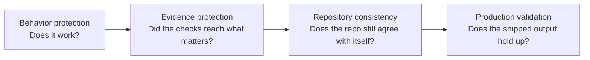
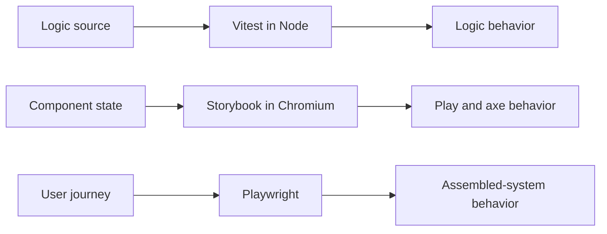
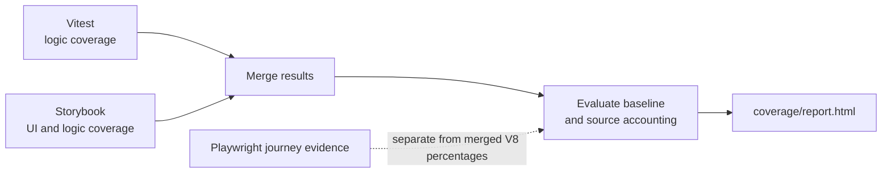
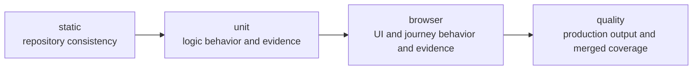
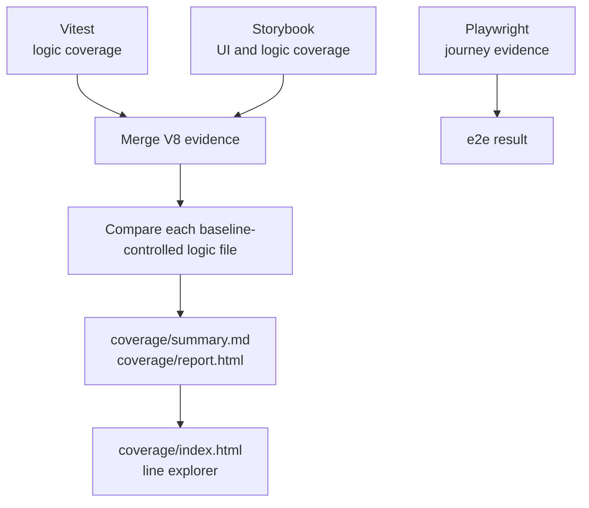
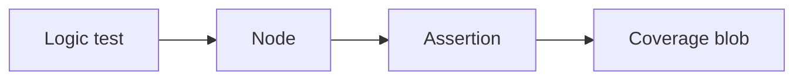
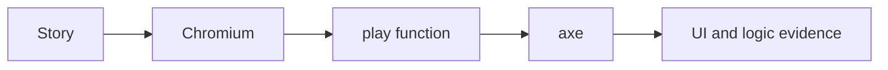
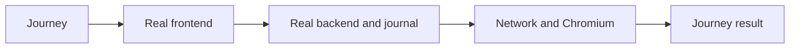
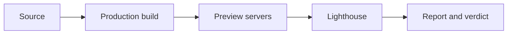

# Testing and validation

> A change is trusted when its behavior, testing evidence, repository consistency, and production output all pass their checks.

This page is the canonical map of how this repository earns that trust. It answers four questions:
what protects a change, how each protection works, when it runs, and where to look when something
fails.

TODO this is wip and needs further trimming as its to much. So read it with that in mind and if you have suggestions feel free to share.

## The protection model

This is the first lens: it explains why checks exist. The layers overlap on purpose. A single
change can need behavioral proof, evidence that the proof still reaches the intended source,
repository-wide consistency, and a production-shaped check.

### 1. Behavior protection

The behavior protectors deliberately overlap:

- **Logic tests:** Vitest in Node checks deterministic models, protocols, state transitions, and
  repository scripts.
- **Component and UI scenarios:** Storybook runs story play functions and axe checks in Chromium,
  so component states, interactions, and accessibility are exercised where users see them.
- **End-to-end journeys:** Playwright drives the real frontend, backend, journal, network, and
  Chromium. It proves selected journeys through the assembled system, including components and
  logic. It is not only for startup files.

### 2. Evidence protection

Evidence protection checks that the repository is still proving the source it claims to prove.

- **Coverage baseline comparison** compares the merged V8 result with the recorded per-file
  baseline.
- **Source accounting** assigns every production source an evidence treatment. It does not claim
  that only one test type can exercise that source.
- **UI story discovery, execution, and coverage evidence** make missing stories, unexecuted
  stories, failed browser stories, and missing UI coverage visible. UI percentages are
  informational; the required evidence is not optional.

Source accounting currently uses these evidence categories:

| Evidence category | Treatment |
| --- | --- |
| `logic-baseline` | Exact per-file unit and Storybook coverage baseline comparison |
| `storybook-ui` | Rendered and exercised by Storybook in Chromium |
| `e2e-bootstrap` | Process or DOM bootstrap exercised by Playwright |
| `test-support` | Storybook-only composition support |
| `type-only` | JSDoc declarations with no runtime code |

Tests ask whether behavior works. Coverage asks whether those tests still reach the source we
expect them to reach.

### 3. Repository consistency

These checks catch contradictions that may not appear in a behavior scenario:

- **Typecheck** verifies generated declarations and every TypeScript project agree.
- **Lint** checks the repository's style and static rules.
- **Dependency audit** checks every install root for high and critical advisories.
- **Mermaid diagram integrity** checks that every Mermaid edge in the docs survives rendering.

### 4. Production validation

Production validation checks the assembled output rather than only its source:

- **Production build** creates the frontend bundle with source maps.
- **Lighthouse** audits three desktop production-preview runs. Performance, Accessibility, Best
  Practices, SEO, and Agentic Browsing stay at 100, with explicit JavaScript transfer and unused
  JavaScript budgets.

## Check legend

Every named mechanism has one job. The tool is the implementation detail; the risk and the check
are the useful parts to remember.

| Mechanism | Why: risk it addresses | What: what it checks |
| --- | --- | --- |
| Logic tests - Vitest in Node | Deterministic domain and repository logic can be wrong | Assertions over models, protocols, state transitions, and scripts |
| Component and UI scenarios - Storybook play and axe in Chromium | A component can work in isolation only for the happy path, or violate accessibility | Discovered stories, play functions, axe checks, and UI plus logic coverage |
| End-to-end journeys - Playwright | The assembled system can fail across frontend, backend, journal, network, or browser boundaries | Selected user journeys through the real frontend, backend, journal, network, and Chromium |
| Coverage baseline comparison | A test suite can regress its source reach without an obvious behavior failure | Statements, branches, functions, and lines per baseline-controlled logic file |
| Source accounting | Production source can be unowned or assigned to the wrong evidence contract | Exactly one evidence treatment for every production source, with baseline paths aligned |
| UI story discovery, execution, and coverage evidence | A UI source can have no story, an unrun story, a failed story, or missing coverage | Declared stories versus executed stories, play and axe results, and informational UI coverage |
| Typecheck | Generated declarations and TypeScript projects can disagree | Declaration generation, declaration checks, and every configured TypeScript project |
| Lint | Inconsistent or invalid code can hide defects and drift | ESLint rules across the checked source directories and config files |
| Dependency audit | A known high or critical package advisory can enter an install root | npm audit in the root, shared, backend, and frontend installs |
| Mermaid diagram integrity | A diagram can silently lose an edge and mislead readers | Mermaid edge structure across the Markdown documentation |
| Production build | Source can pass isolated checks but fail to assemble for shipping | The frontend production bundle with source maps |
| Lighthouse | The production-shaped output can be slow, inaccessible, opaque, or oversized | Three desktop audits, five quality scores, and JavaScript transfer and unused-code budgets |

## The verification pipeline

This is the second lens: it explains when checks run. The stages run in this order:

Verification fails between stages, because later results would no longer mean what they claim.
Within a stage, every check runs so one failure does not hide its siblings.

| Stage | Concept first | Tool and check |
| --- | --- | --- |
| `static` | Type correctness | TypeScript `typecheck` |
| `static` | Style and static rules | ESLint `lint` |
| `static` | Diagram integrity | Mermaid `diagrams` |
| `static` | Dependency risk | npm `audit` |
| `unit` | Logic behavior and logic evidence | Vitest `unit` in Node |
| `browser` | Component scenarios and UI evidence | Storybook `storybook` play and axe in Chromium |
| `browser` | End-to-end journeys | Playwright `e2e` through the assembled system |
| `quality` | Production bundle | Vite `build` |
| `quality` | Production quality | Lighthouse `lighthouse` |
| `quality` | Merged evidence against the baseline | Coverage merge and `coverage` |

The exact current mechanics and selective names are always available through:
`npm run verify help`.

## Human command model

Humans need two primary commands:

| Command | Use it for |
| --- | --- |
| `npm run watch` | Continuous development feedback from Node tests and typecheck |
| `npm test` | The complete authoritative verdict, using the same ordered verification pipeline as CI |

Selective verification remains available to humans and agents when a full run is not useful:
`npm run verify static`, `npm run verify unit`, `npm run verify browser`, `npm run verify quality`,
or any named step from `npm run verify help`.

`npm run watch` never ends. Agents must not start it; use a finite verification command instead.
The watch process is intentionally a development loop, not the complete verdict.

## Coverage: one clean contract

Vitest produces logic coverage evidence. Storybook produces UI and logic coverage evidence. Those
results merge, are evaluated, and produce the coverage report. Playwright provides journey
evidence and is not included in merged V8 percentages.

### The baseline in first principles

Imagine one metric in one baseline-controlled logic file:

| Recorded baseline | Current result | Meaning |
| ---: | ---: | --- |
| 9/10 | 8/10 | Regression. The uncovered count increased and the proportion decreased. |
| 9/10 | 9/10 | Unchanged. The coverage check passes. |
| 9/10 | 10/10 | Improvement. Review it and update the baseline before the check passes. |

Current coverage must recover to the recorded baseline or improve beyond it. If it matches the
baseline, the coverage check passes. If it improves beyond the baseline, the improvement must be
reviewed and recorded before the check passes.

Totals can change when source changes. The uncovered count must not increase, and the covered
proportion must not decrease. The comparison happens separately for statements, branches,
functions, and lines in every baseline-controlled logic file. A new or deleted baseline-controlled
file is also a contract change and appears in the coverage report.

Normal verification never rewrites the baseline. After reviewing a genuine improvement, run
`npm run coverage:update-baseline`; do not keep both an old and a new baseline command.

### How coverage evidence flows

- **Vitest:** loads shared, backend, frontend logic, and repository-script tests in Node; its V8
  blob is the logic evidence.
- **Storybook:** discovers every story, runs every play function and axe check in Chromium, and
  writes UI plus logic coverage evidence.
- **Merge and evaluate:** combines the two V8 blobs, applies source accounting, compares each
  logic file with `coverage-baseline.json`, and writes the Markdown and HTML reports.
- **Playwright:** records assembled-system journey evidence independently from merged V8
  percentages.

## How the main flows work

### Vitest

### Storybook

### Playwright

### Production validation

## What failure means

| Failure | Meaning | First place to look |
| --- | --- | --- |
| Logic test | A tested behavior is wrong or its contract changed | Vitest output and the named test |
| Storybook play or axe | A component state, interaction, or accessibility rule failed in Chromium | Storybook output and the story |
| Playwright journey | The assembled frontend, backend, journal, network, or browser journey failed | Playwright trace and test output |
| Coverage regression | A baseline-controlled file lost evidence, gained uncovered source, or changed its proportion in the wrong direction | `coverage/report.html` and `coverage/summary.md` |
| Source accounting | A production source lacks exactly one evidence treatment, or UI story discovery/execution/coverage is incomplete | Source ownership and UI sections of the coverage report |
| Typecheck, lint, audit, or diagrams | The repository is internally inconsistent or carries a declared dependency/documentation risk | The failing static check |
| Production build | The code cannot assemble into the shipped frontend bundle | Build output |
| Lighthouse | The production-shaped output missed a quality score or budget | `lighthouse-reports/run-1.report.html` |

The verifier prints one verdict and links reports that the run produced. Do not loosen a gate to
make it pass; fix the cause or review the contract change.

## Where evidence appears

| Context | Results |
| --- | --- |
| During development | Terminal feedback from `npm run watch`, plus Storybook's browser UI |
| Local full verification | Verify verdict, `coverage/report.html`, `coverage/index.html` line explorer, and the Lighthouse report |
| CI | The same verdict, with downloadable coverage and Lighthouse artifacts |

## Compact references

- `npm run verify help` - exact current stages, checks, and selective commands
- [ADR 005: Testing seams and Storybook](./adr/005-testing-and-storybook.md)
- [ADR 006: How tests are run](./adr/006-test-execution-model.md)

The existing architecture visual has an incomplete final verification row. Its SVG, HTML, and
Excalidraw source are intentionally unchanged in this slice; visual cleanup is deferred.
