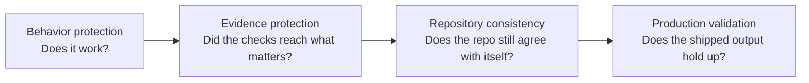
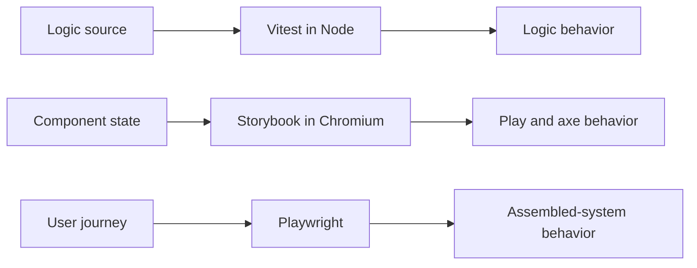
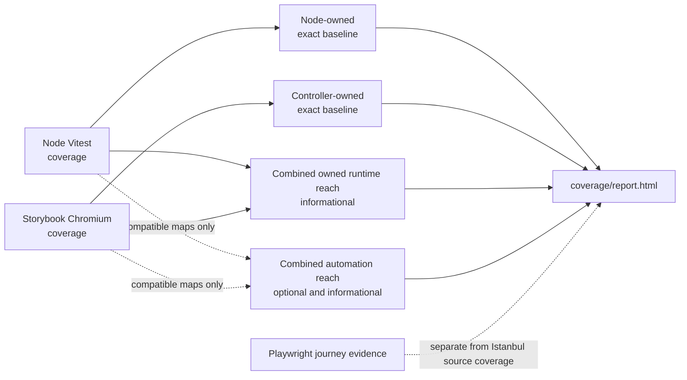
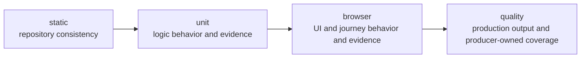
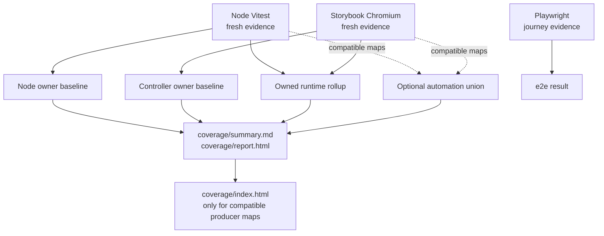
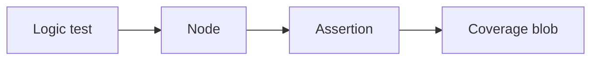
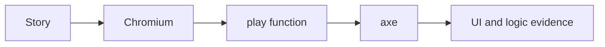
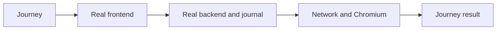
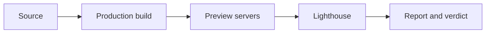

# Testing and validation

> A change is trusted when its behavior, testing evidence, repository consistency, and production output all pass their checks.

This page is the canonical map of how this repository earns that trust. It answers four questions:
what protects a change, how each protection works, when it runs, and where to look when something
fails.

TODO this is wip and needs further trimming as its to much. So read it with that in mind and if you have suggestions feel free to share. this is deferrred until after the ADR and docs rewrite to make it human readable and as simple minimal as possible again.

**See also:** [`docs/verify.md`](./verify.md) for command/stage reference (authoritative stage list:
`npm run verify help`). Decision records: [ADR 006](./adr/006-test-execution-model.md) and
[ADR 010](./adr/010-producer-owned-coverage-evidence.md).

## The protection model

This is the first lens: it explains why checks exist. The layers overlap on purpose. A single
change can need behavioral proof, evidence that the proof still reaches the intended source,
repository-wide consistency, and a production-shaped check.

### 1. Behavior protection

The behavior protectors deliberately overlap:

- **Logic tests:** Vitest in Node checks deterministic models, protocols, state transitions, and
  repository scripts.
- **Component and UI scenarios:** Storybook runs story play functions and axe checks in Chromium,
  so component states, interactions, and accessibility are exercised where users see them.
- **End-to-end journeys:** Playwright drives the real frontend, backend, journal, network, and
  Chromium. It proves selected journeys through the assembled system, including components and
  logic. It is not only for startup files.

### 2. Evidence protection

Evidence protection checks that the repository is still proving the source it claims to prove.

- **Coverage baseline comparison** compares each exact-owned file only with fresh evidence from
  its required Node or Storybook producer.
- **Source accounting** assigns every production source an evidence treatment. It does not claim
  that only one test type can exercise that source.
- **UI story discovery, execution, and coverage evidence** make missing stories, unexecuted
  stories, failed browser stories, and missing UI coverage visible. UI percentages are
  informational; the required evidence is not optional.

Source accounting currently uses these evidence categories:

| Evidence treatment | Required evidence |
| --- | --- |
| `node-runtime` | Exact per-file Node Vitest owner baseline |
| `storybook-controller` | Exact per-file Storybook Chromium owner baseline |
| `rendered-ui` | Story discovery, execution, play assertions, axe, and informational browser coverage |
| `playwright-bootstrap` | Relevant assembled-system journey |
| `test-support-node` | Explicit accounting in its Node test environment |
| `test-support-storybook` | Explicit accounting in its Storybook test environment |
| `type-only` | TypeScript typecheck; no runtime coverage |

Tests ask whether behavior works. Coverage asks whether those tests still reach the source we
expect them to reach.

### 3. Repository consistency

These checks catch contradictions that may not appear in a behavior scenario:

- **Typecheck** verifies generated declarations and every TypeScript project agree.
- **Lint** checks the repository's style and static rules.
- **Lint scope** (`lint-scope`) verifies that every tracked source file is actually linted. ESLint
  reports a file no configuration matches as a warning and still exits zero, so a file can leave
  lint scope silently and take its rules with it. It also holds the repository to one extension per
  language: the root package declares `"type": "module"`, so `.mjs`, `.cjs`, `.mts` and `.cts`
  would restate in a filename what configuration already decides.
- **Dependency audit** checks every install root for high and critical advisories.
- **Mermaid diagram integrity** checks that every Mermaid edge in the docs survives rendering.

### 4. Production validation

Production validation checks the assembled output rather than only its source:

- **Production build** creates the frontend bundle with source maps.
- **Lighthouse** audits three desktop production-preview runs. Performance, Accessibility, Best
  Practices, SEO, and Agentic Browsing stay at 100, with explicit JavaScript transfer and unused
  JavaScript budgets.

## Check legend

Every named mechanism has one job. The tool is the implementation detail; the risk and the check
are the useful parts to remember.

| Mechanism | Why: risk it addresses | What: what it checks |
| --- | --- | --- |
| Logic tests - Vitest in Node | Deterministic domain and repository logic can be wrong | Assertions over models, protocols, state transitions, and scripts |
| Component and UI scenarios - Storybook play and axe in Chromium | A component can work in isolation only for the happy path, or violate accessibility | Discovered stories, play functions, axe checks, and UI plus logic coverage |
| End-to-end journeys - Playwright | The assembled system can fail across frontend, backend, journal, network, or browser boundaries | Selected user journeys through the real frontend, backend, journal, network, and Chromium |
| Coverage baseline comparison | A required producer can regress its source reach without an obvious behavior failure | Statements, branches, functions, and lines per exact-owned file, using only its required producer |
| Source accounting | Production source can be unowned or assigned to the wrong evidence contract | Exactly one evidence treatment for every production source, with baseline paths aligned |
| UI story discovery, execution, and coverage evidence | A UI source can have no story, an unrun story, a failed story, or missing coverage | Declared stories versus executed stories, play and axe results, and informational UI coverage |
| Typecheck | Generated declarations and TypeScript projects can disagree | Declaration generation, declaration checks, and every configured TypeScript project |
| Lint | Inconsistent or invalid code can hide defects and drift | ESLint rules across the whole repository, with exclusions declared in the config |
| Lint scope | A source file can leave lint scope silently, because ESLint warns and exits zero when no configuration matches | Every tracked source file resolves an ESLint configuration or carries a written exemption, and no file encodes a module system in its extension |
| Dependency audit | A known high or critical package advisory can enter an install root | npm audit in the root, shared, backend, and frontend installs |
| Mermaid diagram integrity | A diagram can silently lose an edge and mislead readers | Mermaid edge structure across the Markdown documentation |
| Production build | Source can pass isolated checks but fail to assemble for shipping | The frontend production bundle with source maps |
| Lighthouse | The production-shaped output can be slow, inaccessible, opaque, or oversized | Three desktop audits, five quality scores, and JavaScript transfer and unused-code budgets |

## The verification pipeline

This is the second lens: it explains when checks run. The stages run in this order:

Verification fails between stages, because later results would no longer mean what they claim.
Within a stage, every check runs so one failure does not hide its siblings.

| Stage | Concept first | Tool and check |
| --- | --- | --- |
| `static` | Type correctness | TypeScript `typecheck` |
| `static` | Style and static rules | ESLint `lint` |
| `static` | Lint actually covers the source | `lint-scope` |
| `static` | Diagram integrity | Mermaid `diagrams` |
| `static` | Dependency risk | npm `audit` |
| `unit` | Logic behavior and logic evidence | Vitest `unit` in Node |
| `browser` | Component scenarios and UI evidence | Storybook `storybook` play and axe in Chromium |
| `browser` | End-to-end journeys | Playwright `e2e` through the assembled system |
| `quality` | Production bundle | Vite `build` |
| `quality` | Production quality | Lighthouse `lighthouse` |
| `quality` | Producer-owned evidence against owner baselines | Coverage evaluation and `coverage`; merged maps remain informational |

The exact current mechanics and selective names are always available through:
`npm run verify help`.

## Human command model

Humans need two daily commands:

| Command | Use it for |
| --- | --- |
| `npm run watch` | Continuous development feedback from Node tests and typecheck |
| `npm test` | The complete authoritative verdict, using the same ordered verification pipeline as CI |

Raising the contract — lockfile, stricter TypeScript or ESLint, Storybook coverage admission —
is improve, documented in [`docs/verify.md`](./verify.md). It is not a third daily gate and is not
required to claim done.

Selective verification remains available to humans and agents when a full run is not useful:
`npm run verify static`, `npm run verify unit`, `npm run verify browser`, `npm run verify quality`,
or any named step from `npm run verify help`.

`npm run watch` never ends. Agents must not start it; use a finite verification command instead.
The watch process is intentionally a development loop, not the complete verdict.

## Coverage: one producer-owned contract

Node Vitest and Storybook Chromium retain separate summaries, complete Istanbul maps, source
state, producer identity, and source/configuration digests. Node-owned runtime files compare only
with Node evidence. Storybook controller files compare only with Storybook evidence. Rendered UI
percentages remain informational. Playwright provides journey evidence and does not emit source
coverage for these views.

### The baseline in first principles

Imagine one metric in one baseline-controlled logic file:

| Recorded baseline | Current result | Meaning |
| ---: | ---: | --- |
| 9/10 | 8/10 | Regression. The uncovered count increased and the proportion decreased. |
| 9/10 | 9/10 | Unchanged. The coverage check passes. |
| 9/10 | 10/10 | Improvement. Review it and update the baseline before the check passes. |

Current coverage must recover to the recorded baseline or improve beyond it. If it matches the
baseline, the coverage check passes. If it improves beyond the baseline, the improvement must be
reviewed and recorded before the check passes.

Totals can change when source changes. The uncovered count must not increase, and the covered
proportion must not decrease. The comparison happens separately for statements, branches,
functions, and lines in every exact-owned runtime file. A new or deleted exact-owned
file is also a contract change and appears in the coverage report.

Normal verification never rewrites the baseline. After reviewing a genuine improvement, run
`npm run coverage:update-baseline`; do not keep both an old and a new baseline command.

### Example: review and record an improvement

This is the complete human flow when a change improves coverage:

1. Run the authoritative verdict: `mise exec node@22 -- npm test`.
2. If coverage reports an improvement, open `coverage/report.html` and inspect every changed file
   and metric. Confirm that the uncovered count did not increase and the covered proportion did
   not decrease.
3. Review the source and tests that caused the improvement. This is the decision point; do not
   update the baseline merely to turn a failing check green.
4. Record the reviewed contract with `mise exec node@22 -- npm run coverage:update-baseline`.
5. If Storybook owner tuples changed, also run
   `mise exec node@22 -- npm run coverage:check-storybook-stability` at a clean revision. That
   command is improve, not verify: ten collections against one Storybook process, identical
   tuples required, map drift diagnostic. See [`docs/verify.md`](./verify.md).
6. Inspect `git diff -- coverage-baseline.json` and keep the baseline change with the source change.
7. Run `mise exec node@22 -- npm test` again. The final verdict must be green against the newly
   recorded baseline.

The update command regenerates Node and Storybook evidence together, refuses owner regressions,
updates both producer sections in `coverage-baseline.json`, and rewrites the same reports. A
regression still fails the update command. Ownership or file-set changes require reviewing the
registry and running the same command with `COVERAGE_EVIDENCE_REVIEW_OWNERSHIP=1`. A coverage
provider change starts a fresh tuple contract and requires
`COVERAGE_EVIDENCE_REVIEW_PROVIDER=1`. Both signals apply only to the same canonical baseline
command; there is no second baseline command.

Producer manifests and the generated baseline record the provider name, package, and resolved
version. The Node producer resolves from the root install and Storybook resolves from the frontend
install. Missing metadata, dependency skew, or a provider mismatch with the baseline fails before
the optional automation maps can be combined.

Vitest declares both coverage packages as optional peers, so npm currently materializes
`@vitest/coverage-v8` transitively under Vitest even though neither repository manifest declares or
selects it. The only direct coverage dependency and active configured provider is the pinned
Istanbul package; captured producer provenance verifies that selection at runtime.

### How coverage evidence flows

- **Vitest:** loads shared, backend, frontend logic, and repository-script tests in Node; its
  summary and Istanbul map are retained under `.coverage-reports/node/`.
- **Storybook:** discovers every story, runs every play function and axe check in Chromium, and
  retains its summary and map under `.coverage-reports/storybook/`.
- **Evaluate:** validates both report digests, applies the explicit evidence registry, compares
  each exact-owned file only with its producer section, and writes Markdown and HTML reports.
- **Combine:** selects one required producer per exact-owned file for the normal informational
  rollup. A wider Node plus Storybook union appears only when overlapping maps are compatible.
- **Playwright:** records assembled-system journey evidence independently from Istanbul percentages.

## How the main flows work

### Vitest

### Storybook

### Playwright

The verify gate runs Playwright headless (`npm run verify e2e`); the e2e step frees that lane
before starting. To inspect those journeys, run `npm run e2e:ui` on a **separate** port lane so it
does not block the gate. Dev and preview use their own ports **and** durable journals under
`backend/data/<lane>/`; e2e / e2e-ui / lighthouse keep temp journals. Live port values:
`npm run kill`. Neither e2e command substitutes for the other.

### Production validation

## What failure means

| Failure | Meaning | First place to look |
| --- | --- | --- |
| Logic test | A tested behavior is wrong or its contract changed | Vitest output and the named test |
| Storybook play or axe | A component state, interaction, or accessibility rule failed in Chromium | Storybook output and the story |
| Playwright journey | The assembled frontend, backend, journal, network, or browser journey failed | Playwright trace and test output |
| Coverage regression | An exact-owned file lost evidence from its required producer, gained uncovered source, or changed its proportion in the wrong direction | `coverage/report.html` and `coverage/summary.md` |
| Source accounting | A production source lacks exactly one evidence treatment, or UI story discovery/execution/coverage is incomplete | Source ownership and UI sections of the coverage report |
| Typecheck, lint, audit, or diagrams | The repository is internally inconsistent or carries a declared dependency/documentation risk | The failing static check |
| Production build | The code cannot assemble into the shipped frontend bundle | Build output |
| Lighthouse | The production-shaped output missed a quality score or budget | `lighthouse-reports/run-1.report.html` |

The verifier prints one verdict and links reports that the run produced. Do not loosen a gate to
make it pass; fix the cause or review the contract change.

## Where evidence appears

| Context | Results |
| --- | --- |
| During development | Terminal feedback from `npm run watch`, plus Storybook's browser UI |
| Local full verification | Verify verdict, `coverage/report.html`, the compatible-map `coverage/index.html` line explorer when published, and the Lighthouse report |
| CI | The same verdict, with downloadable coverage and Lighthouse artifacts |

## Compact references

- `npm run verify help` - exact current stages, checks, and selective commands
- [ADR 005: Testing seams and Storybook](./adr/005-testing-and-storybook.md)
- [ADR 006: How tests are run](./adr/006-test-execution-model.md)
- [ADR 010: Producer-owned coverage evidence](./adr/010-producer-owned-coverage-evidence.md)
- [ADR 011: TypeScript as the source language](./adr/011-typescript-source-language.md)
- [Verify reference](./verify.md) — watch / verify / improve, instrumentation jitter

The existing architecture visual has an incomplete final verification row. Its SVG, HTML, and
Excalidraw source are intentionally unchanged in this slice; visual cleanup is deferred.
